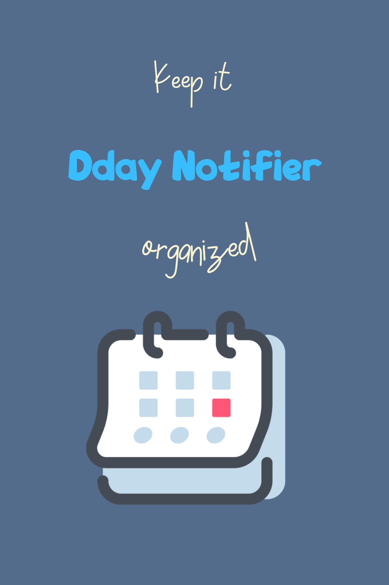

# 
Dday-Notifier

**_Keep it Organized_** 
`This App will notice your important Dday!` 
`You Can Set Your Dday Priority`

### My first React-Native App

## `My Goals`

- Control user using firebase
- Learn basic things about react-native
- Learn JavaScript
- Maybe earn money with admob...?

**For Now, you can download app only from this [link](https://github.com/alpha-src/Dday_Notifier/blob/main/Dday-Notifier.apk)**
